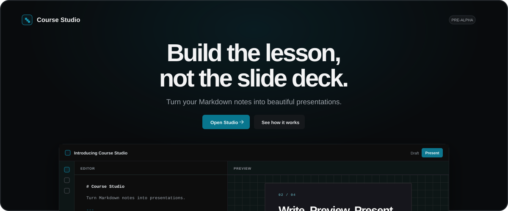
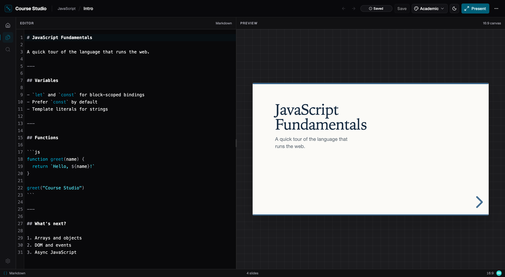
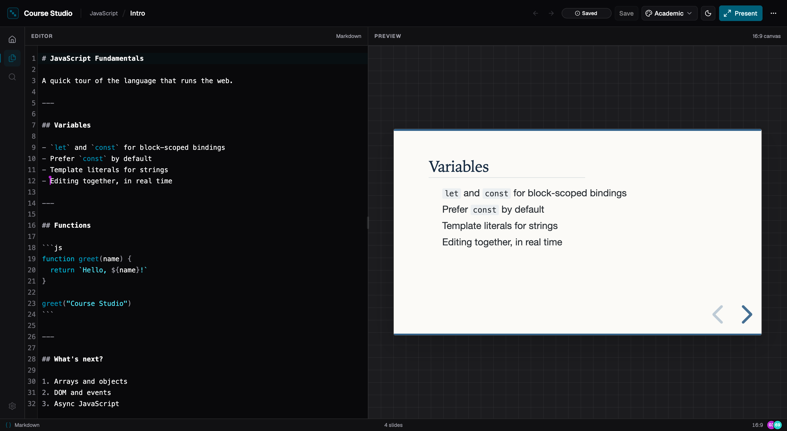

<p align="center">
  
</p>

<p align="center">
  <strong>Build the lesson, not the slide deck.</strong>
</p>

<p align="center">
  
</p>

Course Studio is a Markdown-first course authoring app. Write lessons in Markdown, preview them as slides, and edit the same lesson with other people in real time.

## What works today

- Courses and lessons that persist between sessions
- Markdown editing with autosave
- Live slide preview; type `---` to start a new slide
- Minimal, Academic, and Dark presentation themes
- Real-time collaborative editing
- Remote cursors, selections, and collaborator presence
- PDF export
- Presentation mode with <kbd>Cmd</kbd>/<kbd>Ctrl</kbd> + <kbd>Shift</kbd> + <kbd>P</kbd>
- Light and dark appearance; resizable editor and preview panes

<p align="center">
  
</p>

Open the same lesson on different computers and edit it together: updates sync instantly, with remote cursors, selections, and presence.

<p align="center">
  
</p>

## Run it locally

Prerequisites: Node.js, pnpm, and Docker.

```bash
git clone https://github.com/andremarques94/course-studio.git
cd course-studio
cp .env.example .env
pnpm install
pnpm db:up                                   # PostgreSQL in Docker
pnpm --filter @course-studio/db db:migrate   # apply the schema
pnpm dev                                     # web :3000, api :3001, collab :3002
```

Open [localhost:3000/studio](http://localhost:3000/studio). To try collaboration, open the same lesson in a second window.

Before opening a pull request:

```bash
pnpm check
pnpm build
```

## Project structure

```text
apps/web               TanStack Start application and studio UI
apps/api               Hono HTTP API for courses and lessons
apps/collab            Hocuspocus WebSocket server for Yjs collaboration
packages/presentation  Markdown presentation renderer
packages/themes        Presentation theme definitions and visual recipes
packages/ui            Shared UI components and styles
packages/db            Drizzle schema, migrations, and database client
```

## Direction

Development moves one milestone at a time. Next: persisting collaborative documents, then publishing and versioning. Accounts and public deployments are out of scope in the pre-alpha.

## Contributing

The project is early. Bug reports and small improvements are welcome. For larger changes, [open an issue](https://github.com/andremarques94/course-studio/issues/new) first.
